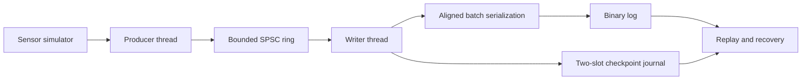

# Embedded Flight Recorder

A C++17 simulation of a crash-resilient telemetry recorder. A producer thread
generates flight data, a consumer thread serializes fixed-size records, and a
bounded single-producer/single-consumer (SPSC) ring separates acquisition from
storage I/O.

The project focuses on four systems concerns:

- bounded memory and observable overload
- corruption detection with CRC32 and contiguous sequence numbers
- batched, explicit-offset file I/O
- recovery to a durably acknowledged checkpoint after interruption

It is a systems-programming project, not certified avionics software or a
hard-real-time implementation.

## Architecture



The ring allocates its storage before worker threads start. The producer and
consumer publish cursor changes with acquire/release atomics; condition
variables park a thread only when the queue crosses an empty or full boundary.
If the producer cannot enqueue within one sample period, the sample is dropped
and the event is recorded.

The writer drains multiple samples at once, serializes them into a reusable
aligned buffer, and uses an explicit-offset `pwrite()` loop that handles
`EINTR` and short writes. Linux builds can reserve file extents with
`fallocate(FALLOC_FL_KEEP_SIZE)`.

## Durability model

Each commit group follows this order:

1. Write one or more complete record batches to the main log.
2. Synchronize the main log.
3. Write the next generation to the inactive checkpoint slot.
4. Synchronize the journal.
5. Report the group as committed.

The sidecar journal contains two CRC-protected checkpoint slots. Recovery chooses
the newest valid slot that agrees with the log's file identity, valid prefix,
record count, and last sequence. A written but uncommitted tail may be removed;
records reported as committed must remain in the selected prefix.

This model relies on the synchronization guarantees provided by the operating
system and filesystem. It does not attempt to survive simultaneous corruption
of both checkpoint slots, acknowledged log corruption, or storage-device loss.

## Binary format

The file begins with a 24-byte header followed by fixed 84-byte records:

```text
file header
  magic | version | header size | start time | record size | CRC32

record
  magic | version | header size | payload size
  sequence | timestamp
  altitude | airspeed | heading | vertical speed
  engine temperature | engine RPM | status flags
  CRC32
```

Replay validates the file header, record metadata, CRC32, and exact sequence
continuity in one forward scan. The current format requires a little-endian
target with IEEE-754 `double`.

## Build and test

Requirements:

- CMake 3.16 or newer
- a C++17 compiler
- a POSIX-like operating system

```bash
cmake --preset debug
cmake --build --preset debug
ctest --preset debug
```

Release and sanitizer presets are also available:

```bash
cmake --preset release
cmake --build --preset release
ctest --preset release

cmake --preset ubsan
cmake --build --preset ubsan
ctest --preset ubsan
```

On Linux, the `linux-asan-ubsan` preset enables both AddressSanitizer and
UndefinedBehaviorSanitizer.

The test suite covers ring wraparound and concurrency, packed serialization,
CRC and metadata corruption, truncated records, sequence gaps, short writes,
group commit, checkpoint fallback, legacy-journal migration, and startup
recovery.

## Quick demo

```bash
scripts/run_demo.sh
```

The script builds the Release configuration, uses a temporary directory, records
and replays a deterministic flight, injects a byte-level corruption, verifies
that replay rejects it, and runs the process-interruption matrix. See
[`docs/DEMO.md`](docs/DEMO.md) for the expected output.

## Command-line tools

Record a five-second session:

```bash
./build-debug/flight_recorder \
  --output flight_log.bin \
  --duration-seconds 5 \
  --sample-rate-hz 20 \
  --buffer-size 256 \
  --batch-size 64 \
  --sync-every-batches 1 \
  --seed 42
```

Inspect or export the valid prefix:

```bash
./build-debug/replay_tool flight_log.bin --summary
./build-debug/replay_tool flight_log.bin --csv flight_log.csv
```

Validate a log and optionally remove an invalid tail:

```bash
./build-debug/recovery_tool flight_log.bin
./build-debug/recovery_tool flight_log.bin --truncate
```

Inject faults for manual testing:

```bash
./build-debug/fault_injector truncate flight_log.bin 16
./build-debug/fault_injector corrupt flight_log.bin 4 12
```

Run 180 deterministic process-interruption cases:

```bash
./build-release/crash_matrix artifacts/crash-matrix/local-release.json
```

The matrix covers interruption before the main write, during a partial main
write, after the main write but before synchronization, after main-log
synchronization but before the checkpoint, during a partial checkpoint write,
and after the journal has been synchronized. Each case performs recovery twice
and verifies the resulting prefix, file size, sequence continuity, and
idempotence.

These are deterministic process-level fault tests. They are useful for checking
commit-state transitions, but they are not a substitute for power-cut testing
on real storage hardware.

## Benchmarking

`recorder_benchmark` exercises the complete unpaced path: production, ring
transfer, serialization, real file writes, checkpoint commits, and replay
validation. It reports:

- generated, written, committed, and dropped counts
- end-to-end records per second
- one-second throughput windows
- main-log write latency
- main-log synchronization latency
- operation counters and platform metadata

Run the repeatable Linux benchmark suite with:

```bash
scripts/run_linux_benchmarks.sh artifacts/linux-benchmarks
```

Results are intentionally generated locally rather than checked into Git.
Throughput and latency depend on the CPU, kernel, filesystem, storage device,
configuration, and competing load. Metric definitions and the experimental
method are documented in [`docs/BENCHMARKS.md`](docs/BENCHMARKS.md).

## Repository layout

```text
include/flight_recorder/  public types and recorder components
src/                      recorder, writer, simulator, recovery
tools/                    replay, recovery, fault, crash, benchmark utilities
tests/                    deterministic test suite
scripts/                  demo and Linux benchmark orchestration
docs/                     format, benchmark, and demo documentation
```

## Known limitations

- The format is little-endian and does not yet support cross-endian decoding.
- There is no segment rotation or retention policy.
- The recorder does not provide hard-real-time scheduling guarantees.
- Fault injection models process interruption and partial writes, not a physical
  loss of power or storage media.
- CRC32 detects accidental corruption but is not cryptographic authentication.
- Linux preallocation behavior and performance must be measured on the target
  filesystem.
